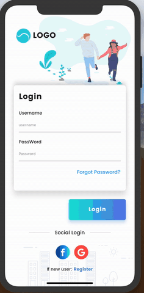

# Scola Tutoring App

## To run

### Firebase config
1. Setup firebase project
2. Add android app with identifier as of in manifest.xml - currently com.example.letutor, change  it to the one you want your published app id to be.
3. Add android app with identifier as of in manifest.xml - currently com.letutor, on testFlight
4. Add courses and levels collection with field as specified in model classes courses 
https://github.com/SdxCoder/letutor/blob/master/lib/core/models/course.dart and levels https://github.com/SdxCoder/letutor/blob/master/lib/core/models/level.dart

### Facebook Auth
1. Enable facebook auth from firebase authentication options
2. To setup facebook auth for android, follow following instructions
   a- Setup app here https://developers.facebook.com/docs/facebook-login/android
   b- Then follow instructions for android here https://pub.dev/packages/flutter_facebook_login
3. To setup facebook auth for ios, follow following instructions
   a- Setup app here https://developers.facebook.com/docs/facebook-login/ios
   b- Then follow instructions for ios here https://pub.dev/packages/flutter_facebook_login
4. Your facebook app secret and app id are required in the firebase facebook auth enabling option, make sure to add it there. You can find app id and secret here https://developers.facebook.com/apps on selecting the app u created

### Google Auth
1. To setup Google auth for android and ios, follow following instructions
   a- https://pub.dev/packages/google_sign_in

## 1st Stage

User Functionality:
- Login (Facebook, Google, Apple[mandatory] for iOS?)
- Track his tutoring bookings
- Search for tutors
- Book lessons

Tutor Functionality
- Track his tutoring lessons
- Add his availability
- Track his earnings

Admin Functionality
- Search tutor by email 
* Edit tutor profile (courses and academic level)
* See tutor availability
- Confirm Bookings: Initially bookings will be created on `unconfirmed`. When payments is made (off app) then the admin will confirm the booking. This will consist only in a button on the booking screen.

Push Notifications:
- To admin on new booking.
- To tutor when booking is confirmed.
- To user 15min before booking.

Web:
- Launch beta flutter web.

## 2nd Stage
User Functionality:
- Group tutorings: add up to 10 people into a tutoring. Discount applied.
- Payments: Local payment providers.

## 3rd Stage
User Functionality:
- Apply discount
* Gamification: collect `Scola Coins` on each booking and redeem those coins.
- WebRTC backend to allow video calls within app.

